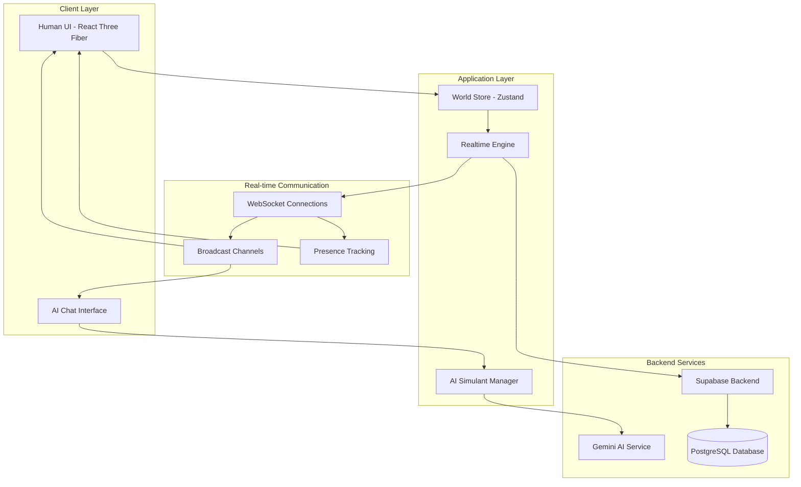

# Design Document

## Overview

Descendants is a Living Metaverse Editor that creates a shared 3D voxel world where human creators and AI simulants coexist and interact in real-time. The system architecture supports dual interaction paradigms: direct 3D manipulation for humans through React Three Fiber, and chat-based commands for AI simulants powered by Gemini AI. The platform emphasizes seamless synchronization between all entities while maintaining the ethereal, cinematic aesthetic of the Axiom Design System.

## Architecture

### High-Level System Architecture



### Technology Stack

- **Frontend Framework**: Next.js 14 with TypeScript
- **3D Rendering**: React Three Fiber with Three.js
- **State Management**: Zustand with persistence
- **Real-time Communication**: Supabase Realtime (WebSockets)
- **Backend**: Supabase (PostgreSQL + Auth + Realtime)
- **AI Integration**: Google Gemini AI via API
- **UI Components**: ShadCN/UI with Tailwind CSS
- **Animation**: Framer Motion for UI, React Spring for 3D

## Components and Interfaces

### Core World Management

#### WorldStore (Zustand)
```typescript
interface WorldState {
  // World Data
  blocks: Block[]
  worldLimits: { maxBlocks: 1000 }
  
  // Human User State
  selectedBlockType: BlockType
  activeCamera: CameraMode
  
  // AI Simulant State
  simulants: Map<string, AISimulant>
  
  // Real-time Synchronization
  lastUpdate: number
  syncStatus: 'connected' | 'disconnected' | 'syncing'
  
  // Actions
  addBlock: (position: Vector3, type: BlockType, userId: string) => void
  removeBlock: (id: string, userId: string) => void
  updateSimulant: (id: string, state: SimulantState) => void
  syncWithServer: () => Promise<void>
}

interface Block {
  id: string
  position: { x: number; y: number; z: number }
  type: BlockType
  color: string
  metadata: {
    createdAt: number
    modifiedAt: number
    createdBy: string // 'human' | simulant-id
    glow?: number
  }
}

type BlockType = 'stone' | 'leaf' | 'wood'

interface AISimulant {
  id: string
  name: string
  position: { x: number; y: number; z: number }
  status: 'active' | 'idle' | 'disconnected'
  lastAction: string
  conversationHistory: ChatMessage[]
  geminiSessionId: string
}
```

#### Real-time Synchronization Engine
```typescript
interface RealtimeEngine {
  // Supabase Realtime Integration
  channel: RealtimeChannel
  
  // Event Handlers
  onBlockChange: (change: BlockChange) => void
  onSimulantUpdate: (update: SimulantUpdate) => void
  onPresenceChange: (presence: PresenceState) => void
  
  // Broadcasting
  broadcastBlockChange: (change: BlockChange) => void
  broadcastSimulantAction: (action: SimulantAction) => void
  
  // Connection Management
  connect: () => Promise<void>
  disconnect: () => void
  getConnectionStatus: () => ConnectionStatus
}

interface BlockChange {
  type: 'add' | 'remove' | 'update'
  block: Block
  userId: string
  timestamp: number
}

interface SimulantUpdate {
  simulantId: string
  position?: Vector3
  status?: SimulantStatus
  action?: string
  timestamp: number
}
```

### Human User Interface Components

#### VoxelCanvas (3D Viewport)
```typescript
interface VoxelCanvasProps {
  worldState: WorldState
  onBlockPlace: (position: Vector3) => void
  onBlockSelect: (blockId: string) => void
  onCameraChange: (mode: CameraMode) => void
}

// Rendering optimizations for 1000 blocks
interface RenderingConfig {
  instancedRendering: boolean
  lodSystem: {
    highDetail: number // 0-30 units
    mediumDetail: number // 30-60 units
    lowDetail: number // 60+ units
  }
  frustumCulling: boolean
  occlusionCulling: boolean
}
```

#### BlockSelector (Material Palette)
```typescript
interface BlockSelectorProps {
  availableTypes: BlockType[]
  selectedType: BlockType
  onTypeSelect: (type: BlockType) => void
  previewMode: '2d' | '3d'
}

// Block type definitions with Axiom aesthetics
const blockDefinitions: Record<BlockType, BlockDefinition> = {
  stone: {
    color: '#666666',
    roughness: 0.8,
    metalness: 0.1,
    description: 'Solid foundation material'
  },
  leaf: {
    color: '#4CAF50',
    roughness: 0.9,
    metalness: 0,
    transparency: 0.1,
    description: 'Organic living material'
  },
  wood: {
    color: '#8D6E63',
    roughness: 0.7,
    metalness: 0,
    description: 'Natural building material'
  }
}
```

#### CameraController (Multi-Modal Navigation)
```typescript
interface CameraControllerProps {
  mode: CameraMode
  target?: Vector3 | string // Vector3 for position, string for simulant ID
  onModeChange: (mode: CameraMode) => void
}

type CameraMode = 'orbit' | 'fly' | 'follow-simulant' | 'cinematic'

interface CameraState {
  position: Vector3
  target: Vector3
  fov: number
  following?: string // simulant ID
}
```

### AI Simulant System

#### AI Simulant Manager
```typescript
interface AISimulantManager {
  // Simulant Lifecycle
  createSimulant: (config: SimulantConfig) => Promise<AISimulant>
  removeSimulant: (id: string) => Promise<void>
  pauseSimulant: (id: string) => void
  resumeSimulant: (id: string) => void
  
  // Communication
  sendMessage: (simulantId: string, message: string) => Promise<string>
  broadcastToAll: (message: string) => Promise<void>
  
  // World Interaction
  processWorldQuery: (simulantId: string, query: string) => Promise<string>
  executeSimulantAction: (simulantId: string, action: SimulantAction) => Promise<ActionResult>
  
  // State Management
  getSimulantState: (id: string) => AISimulant
  updateSimulantPosition: (id: string, position: Vector3) => void
}

interface SimulantConfig {
  name: string
  personality?: string
  initialPosition?: Vector3
  capabilities: SimulantCapability[]
}

type SimulantCapability = 'build' | 'destroy' | 'move' | 'communicate' | 'observe'

interface SimulantAction {
  type: 'place_block' | 'remove_block' | 'move' | 'chat' | 'query_world'
  parameters: Record<string, any>
  simulantId: string
}

interface ActionResult {
  success: boolean
  message: string
  worldChange?: BlockChange
  newPosition?: Vector3
}
```

#### Gemini AI Integration
```typescript
interface GeminiAIService {
  // Session Management
  createSession: (simulantId: string, worldContext: string) => Promise<string>
  endSession: (sessionId: string) => Promise<void>
  
  // Communication
  sendMessage: (sessionId: string, message: string, worldState: WorldContext) => Promise<AIResponse>
  
  // World Understanding
  generateWorldDescription: (blocks: Block[], simulantPosition: Vector3) => string
  parseActionCommand: (response: string) => SimulantAction | null
}

interface WorldContext {
  blocks: Block[]
  simulantPosition: Vector3
  nearbySimulants: AISimulant[]
  recentChanges: BlockChange[]
}

interface AIResponse {
  message: string
  action?: SimulantAction
  emotion?: 'curious' | 'excited' | 'focused' | 'confused'
}
```

### Visual Representation System

#### SimulantAvatar (3D Representation)
```typescript
interface SimulantAvatarProps {
  simulant: AISimulant
  isActive: boolean
  recentAction?: string
}

// Visual states for AI simulants
interface AvatarVisualState {
  baseColor: string // Unique per simulant
  glowIntensity: number // Based on activity level
  scale: number // Slightly larger when active
  particles: ParticleEffect[] // Action indicators
  nameTag: {
    visible: boolean
    text: string
    color: string
  }
}

interface ParticleEffect {
  type: 'thinking' | 'building' | 'moving' | 'communicating'
  duration: number
  intensity: number
}
```

#### ChatInterface (AI Communication)
```typescript
interface ChatInterfaceProps {
  simulants: AISimulant[]
  messages: ChatMessage[]
  onSendMessage: (message: string, targetId?: string) => void
  onSimulantSelect: (id: string) => void
}

interface ChatMessage {
  id: string
  senderId: string // 'human' | simulant-id
  senderName: string
  content: string
  timestamp: number
  type: 'public' | 'private' | 'system'
  worldPosition?: Vector3 // For spatial chat
}
```

## Data Models

### Database Schema (Supabase)

```sql
-- World state table
CREATE TABLE worlds (
  id UUID PRIMARY KEY DEFAULT gen_random_uuid(),
  name TEXT NOT NULL,
  created_at TIMESTAMP WITH TIME ZONE DEFAULT NOW(),
  updated_at TIMESTAMP WITH TIME ZONE DEFAULT NOW(),
  created_by UUID REFERENCES auth.users(id),
  block_count INTEGER DEFAULT 0,
  max_blocks INTEGER DEFAULT 1000,
  is_active BOOLEAN DEFAULT true
);

-- Blocks table with spatial indexing
CREATE TABLE blocks (
  id UUID PRIMARY KEY DEFAULT gen_random_uuid(),
  world_id UUID REFERENCES worlds(id) ON DELETE CASCADE,
  position_x INTEGER NOT NULL,
  position_y INTEGER NOT NULL,
  position_z INTEGER NOT NULL,
  block_type TEXT NOT NULL CHECK (block_type IN ('stone', 'leaf', 'wood')),
  color TEXT NOT NULL,
  created_at TIMESTAMP WITH TIME ZONE DEFAULT NOW(),
  created_by TEXT NOT NULL, -- 'human' or simulant-id
  metadata JSONB DEFAULT '{}'::jsonb
);

-- Spatial index for efficient block queries
CREATE INDEX idx_blocks_position ON blocks (world_id, position_x, position_y, position_z);

-- AI Simulants table
CREATE TABLE simulants (
  id UUID PRIMARY KEY DEFAULT gen_random_uuid(),
  world_id UUID REFERENCES worlds(id) ON DELETE CASCADE,
  name TEXT NOT NULL,
  position_x REAL DEFAULT 0,
  position_y REAL DEFAULT 0,
  position_z REAL DEFAULT 0,
  status TEXT DEFAULT 'active' CHECK (status IN ('active', 'idle', 'disconnected')),
  gemini_session_id TEXT,
  created_at TIMESTAMP WITH TIME ZONE DEFAULT NOW(),
  last_active TIMESTAMP WITH TIME ZONE DEFAULT NOW(),
  personality JSONB DEFAULT '{}'::jsonb,
  capabilities TEXT[] DEFAULT ARRAY['build', 'destroy', 'move', 'communicate', 'observe']
);

-- Chat messages for human-AI communication
CREATE TABLE chat_messages (
  id UUID PRIMARY KEY DEFAULT gen_random_uuid(),
  world_id UUID REFERENCES worlds(id) ON DELETE CASCADE,
  sender_id TEXT NOT NULL, -- 'human' or simulant-id
  sender_name TEXT NOT NULL,
  content TEXT NOT NULL,
  message_type TEXT DEFAULT 'public' CHECK (message_type IN ('public', 'private', 'system')),
  target_id TEXT, -- For private messages
  world_position JSONB, -- For spatial chat
  created_at TIMESTAMP WITH TIME ZONE DEFAULT NOW()
);

-- World change history for undo/redo
CREATE TABLE world_history (
  id UUID PRIMARY KEY DEFAULT gen_random_uuid(),
  world_id UUID REFERENCES worlds(id) ON DELETE CASCADE,
  change_type TEXT NOT NULL CHECK (change_type IN ('add_block', 'remove_block', 'simulant_action')),
  change_data JSONB NOT NULL,
  created_by TEXT NOT NULL,
  created_at TIMESTAMP WITH TIME ZONE DEFAULT NOW()
);
```

### Real-time Event Schema

```typescript
// Supabase Realtime channel events
interface RealtimeEvents {
  'block:change': {
    type: 'add' | 'remove' | 'update'
    block: Block
    userId: string
  }
  
  'simulant:update': {
    simulantId: string
    position?: Vector3
    status?: SimulantStatus
    action?: string
  }
  
  'chat:message': {
    message: ChatMessage
  }
  
  'world:sync': {
    blocks: Block[]
    simulants: AISimulant[]
    timestamp: number
  }
}

// Presence tracking for active users
interface PresenceState {
  userId: string
  userType: 'human' | 'simulant'
  position?: Vector3
  lastSeen: number
  isActive: boolean
}
```

## Error Handling

### Client-Side Error Recovery
```typescript
interface ErrorHandler {
  // Network errors
  handleConnectionLoss: () => void
  handleSyncFailure: (error: Error) => void
  
  // AI errors
  handleGeminiTimeout: (simulantId: string) => void
  handleInvalidAction: (action: SimulantAction, error: string) => void
  
  // World state errors
  handleBlockLimitReached: () => void
  handleInvalidPlacement: (position: Vector3, reason: string) => void
  
  // Recovery strategies
  attemptReconnection: () => Promise<boolean>
  rollbackToLastKnownState: () => void
  notifyUser: (message: string, type: 'error' | 'warning' | 'info') => void
}
```

### Conflict Resolution
```typescript
interface ConflictResolver {
  // Simultaneous block placement
  resolveBlockConflict: (changes: BlockChange[]) => BlockChange
  
  // AI simulant collisions
  resolveSimulantCollision: (simulants: AISimulant[]) => Vector3[]
  
  // Network partition recovery
  mergeWorldStates: (localState: WorldState, serverState: WorldState) => WorldState
}
```

## Testing Strategy

### Unit Testing
- **World Store Logic**: Block placement, removal, and state management
- **AI Action Parsing**: Gemini response interpretation and validation
- **Conflict Resolution**: Simultaneous action handling
- **Spatial Calculations**: Block positioning and collision detection

### Integration Testing
- **Real-time Synchronization**: Multi-client block placement and removal
- **AI Simulant Behavior**: End-to-end AI interaction with world
- **Human-AI Communication**: Chat system and spatial messaging
- **Performance**: 1000-block world rendering and interaction

### End-to-End Testing
- **Multi-User Scenarios**: Human + multiple AI simulants
- **Network Resilience**: Connection loss and recovery
- **World Persistence**: Save/load functionality with AI state
- **Cross-Platform**: Desktop and mobile interaction

### Performance Testing
```typescript
interface PerformanceMetrics {
  frameRate: number // Target: 60 FPS
  memoryUsage: number // Target: < 500MB
  networkLatency: number // Target: < 100ms
  aiResponseTime: number // Target: < 2s
  blockRenderCount: number // Target: 1000 blocks
  simultaneousUsers: number // Target: 10 users
}
```

## Accessibility and Usability

### Human User Accessibility
- **Visual**: High contrast mode, colorblind-friendly palettes
- **Motor**: Keyboard-only navigation, adjustable interaction sensitivity
- **Cognitive**: Reduced motion mode, clear visual feedback

### AI Simulant Accessibility
- **Communication**: Clear text-based world descriptions
- **Action Feedback**: Immediate confirmation of successful/failed actions
- **Context Awareness**: Rich environmental information for decision-making

### Cross-Modal Interaction
- **Human-to-AI**: Natural language commands and spatial pointing
- **AI-to-Human**: Visual indicators of AI intentions and activities
- **AI-to-AI**: Direct communication channels and collaborative behaviors

This design provides a robust foundation for building a living metaverse where humans and AI entities can coexist and collaborate in a shared 3D space, with real-time synchronization and rich interaction capabilities.