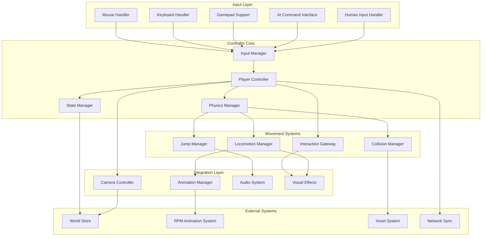

# Design Document

## Overview

The Player Controller System is a comprehensive, modular character control framework that bridges human input and AI simulant control within the Descendants metaverse. Inspired by GTA 6's sophisticated movement mechanics, the system provides physics-based locomotion, intelligent camera coupling, contextual interactions, and seamless animation integration. The architecture supports both third-person and first-person perspectives, with shared controller components that ensure consistent behavior between human players and AI simulants while maintaining 60 FPS performance with multiple active characters.

## Architecture

### High-Level Player Controller Architecture



### Technology Integration

- **React Three Fiber**: Core 3D rendering and physics integration
- **Three.js**: Vector math, collision detection, and camera management
- **Zustand WorldStore**: State persistence and simulant management
- **RPM Animation System**: Character animation and state machines
- **Cannon.js/Rapier**: Physics simulation and collision detection
- **Input Management**: Cross-platform input handling and mapping

## Components and Interfaces

### Core Player Controller

#### PlayerController (Main Class)
```typescript
interface PlayerController {
  // Core Properties
  id: string
  entityType: 'human' | 'simulant'
  isActive: boolean
  
  // Movement State
  position: Vector3
  rotation: Euler
  velocity: Vector3
  acceleration: Vector3
  
  // Control Mode
  controlMode: ControlMode
  inputSource: InputSource
  
  // Core Systems
  inputManager: InputManager
  physicsManager: PhysicsManager
  stateManager: StateManager
  locomotionManager: LocomotionManager
  
  // Lifecycle Methods
  initialize: (config: ControllerConfig) => void
  update: (deltaTime: number) => void
  dispose: () => void
  
  // Control Methods
  setControlMode: (mode: ControlMode) => void
  enableInput: (enable: boolean) => void
  resetToPosition: (position: Vector3, rotation?: Euler) => void
  
  // State Queries
  getMovementState: () => MovementState
  isGrounded: () => boolean
  isMoving: () => boolean
  canJump: () => boolean
  
  // Event Callbacks
  onStateChange?: (state: MovementState) => void
  onCollision?: (collision: CollisionEvent) => void
  onInteraction?: (interaction: InteractionEvent) => void
}

type ControlMode = 'free' | 'locked' | 'cinematic' | 'interaction'
type InputSource = 'keyboard' | 'gamepad' | 'ai' | 'network'

interface ControllerConfig {
  entityId: string
  entityType: 'human' | 'simulant'
  startPosition: Vector3
  startRotation?: Euler
  
  // Movement Settings
  walkSpeed: number
  runSpeed: number
  jumpHeight: number
  acceleration: number
  deceleration: number
  
  // Physics Settings
  mass: number
  friction: number
  airControl: number
  gravityScale: number
  
  // Camera Settings
  cameraMode: 'third-person' | 'first-person'
  cameraOffset: Vector3
  cameraFollowSpeed: number
  
  // Input Settings
  mouseSensitivity: number
  keyBindings: KeyBindings
  enableGamepad: boolean
  
  // Integration Settings
  enablePhysics: boolean
  enableAnimations: boolean
  enableAudio: boolean
  enableNetworking: boolean
}
```

#### Movement State Management
```typescript
interface MovementState {
  // Position and Orientation
  position: Vector3
  rotation: Euler
  velocity: Vector3
  angularVelocity: Vector3
  
  // Movement Status
  isGrounded: boolean
  isMoving: boolean
  isRunning: boolean
  isJumping: boolean
  isFalling: boolean
  isClimbing: boolean
  isInteracting: boolean
  
  // Movement Direction
  moveDirection: Vector3
  lookDirection: Vector3
  inputDirection: Vector2
  
  // State Timing
  stateStartTime: number
  lastGroundedTime: number
  lastJumpTime: number
  
  // Animation State
  currentAnimation: string
  animationBlendWeights: Map<string, number>
  
  // Physics State
  groundNormal: Vector3
  supportSurface?: CollisionSurface
  waterLevel?: number
}

interface CollisionSurface {
  normal: Vector3
  material: SurfaceMaterial
  friction: number
  bounciness: number
  walkable: boolean
}

type SurfaceMaterial = 'stone' | 'wood' | 'leaf' | 'water' | 'air'
```

### Input Management System

#### InputManager (Unified Input Handling)
```typescript
interface InputManager {
  // Input Sources
  keyboardHandler: KeyboardHandler
  mouseHandler: MouseHandler
  gamepadHandler: GamepadHandler
  aiCommandInterface: AICommandInterface
  
  // Current Input State
  currentInput: InputState
  previousInput: InputState
  
  // Input Processing
  processInput: (deltaTime: number) => InputCommands
  setInputSource: (source: InputSource) => void
  enableInput: (enable: boolean) => void
  
  // Configuration
  updateKeyBindings: (bindings: KeyBindings) => void
  setMouseSensitivity: (sensitivity: number) => void
  calibrateGamepad: () => void
  
  // Events
  onInputChange?: (input: InputState) => void
  onDeviceConnect?: (device: InputDevice) => void
  onDeviceDisconnect?: (device: InputDevice) => void
}

interface InputState {
  // Movement Input
  moveForward: number // -1 to 1
  moveRight: number // -1 to 1
  moveUp: number // -1 to 1
  
  // Look Input
  lookHorizontal: number
  lookVertical: number
  
  // Action Input
  jump: boolean
  run: boolean
  crouch: boolean
  interact: boolean
  
  // Special States
  isPointerLocked: boolean
  inputDevice: InputDevice
  timestamp: number
}

interface InputCommands {
  // Movement Commands
  moveVector: Vector3
  lookDelta: Vector2
  
  // Action Commands
  jumpPressed: boolean
  runHeld: boolean
  crouchHeld: boolean
  interactPressed: boolean
  
  // Meta Commands
  enableRunning: boolean
  enableJumping: boolean
  resetPosition: boolean
}

type InputDevice = 'keyboard' | 'gamepad' | 'touch' | 'ai'

// GTA 6-style key bindings
const DEFAULT_KEY_BINDINGS: KeyBindings = {
  moveForward: ['KeyW', 'ArrowUp'],
  moveBackward: ['KeyS', 'ArrowDown'],
  moveLeft: ['KeyA', 'ArrowLeft'],
  moveRight: ['KeyD', 'ArrowRight'],
  jump: ['Space'],
  run: ['ShiftLeft', 'ShiftRight'],
  crouch: ['KeyC', 'ControlLeft'],
  interact: ['KeyE', 'KeyF'],
  cameraToggle: ['KeyV'],
  resetCamera: ['KeyR'],
  // Gamepad mappings
  gamepad: {
    moveStick: 'left',
    lookStick: 'right',
    jump: 'button0', // A/X
    run: 'button1', // B/Circle
    crouch: 'button2', // X/Square
    interact: 'button3', // Y/Triangle
  }
} as const;
```

#### AI Command Interface
```typescript
interface AICommandInterface {
  // High-Level AI Commands
  moveTo: (target: Vector3, speed?: number) => Promise<void>
  lookAt: (target: Vector3) => void
  followPath: (waypoints: Vector3[]) => Promise<void>
  performAction: (action: AIAction) => Promise<void>
  
  // Low-Level Movement Control
  setMoveDirection: (direction: Vector3) => void
  setLookDirection: (direction: Vector3) => void
  triggerJump: () => void
  enableRunning: (enable: boolean) => void
  
  // State Queries
  getCurrentState: () => MovementState
  isPathBlocked: () => boolean
  getDistanceToTarget: () => number
  
  // Navigation
  findPath: (start: Vector3, end: Vector3) => Vector3[]
  avoidObstacles: (enable: boolean) => void
  setNavigationMesh: (navMesh: NavigationMesh) => void
  
  // Behavior Control
  setBehaviorMode: (mode: AIBehaviorMode) => void
  setReactionTime: (time: number) => void
  setMovementStyle: (style: MovementStyle) => void
}

type AIAction = 'idle' | 'walk' | 'run' | 'jump' | 'interact' | 'look_around' | 'celebrate'
type AIBehaviorMode = 'precise' | 'natural' | 'erratic' | 'cautious' | 'aggressive'
type MovementStyle = 'robotic' | 'human-like' | 'energetic' | 'casual' | 'focused'

interface NavigationMesh {
  vertices: Vector3[]
  faces: NavFace[]
  connections: NavConnection[]
}

interface NavFace {
  vertices: [number, number, number]
  normal: Vector3
  walkable: boolean
  surfaceType: SurfaceMaterial
}

interface NavConnection {
  from: number
  to: number
  cost: number
  bidirectional: boolean
}
```

### Physics Management System

#### PhysicsManager (Advanced Physics Integration)
```typescript
interface PhysicsManager {
  // Core Physics
  rigidBody: RigidBody
  collisionShape: CollisionShape
  gravityScale: number
  
  // Physics Properties
  mass: number
  friction: number
  restitution: number
  drag: number
  angularDrag: number
  
  // Ground Detection
  groundChecker: GroundChecker
  groundDistance: number
  groundNormal: Vector3
  slopeLimit: number
  
  // Movement Physics
  applyMovementForce: (force: Vector3) => void
  applyImpulse: (impulse: Vector3) => void
  setVelocity: (velocity: Vector3) => void
  addVelocity: (velocity: Vector3) => void
  
  // Collision Handling
  onCollisionEnter: (collision: Collision) => void
  onCollisionStay: (collision: Collision) => void
  onCollisionExit: (collision: Collision) => void
  
  // Advanced Features
  enableKinematic: (enable: boolean) => void
  setConstraints: (constraints: MovementConstraints) => void
  applyPostPhysicsCorrection: () => void
  
  // Physics Queries
  raycast: (origin: Vector3, direction: Vector3, maxDistance: number) => RaycastHit[]
  sphereCast: (origin: Vector3, radius: number, direction: Vector3) => RaycastHit[]
  checkSphere: (center: Vector3, radius: number) => Collider[]
}

interface GroundChecker {
  // Ground Detection Settings
  raycastDistance: number
  sphereRadius: number
  groundLayers: number[]
  
  // Detection Methods
  checkGround: () => GroundInfo
  isGrounded: () => boolean
  getGroundAngle: () => number
  getGroundMaterial: () => SurfaceMaterial
  
  // Advanced Checks
  checkSlope: () => boolean
  checkStairs: () => boolean
  predictLanding: (velocity: Vector3) => Vector3
}

interface GroundInfo {
  isGrounded: boolean
  distance: number
  point: Vector3
  normal: Vector3
  material: SurfaceMaterial
  surfaceVelocity: Vector3
  friction: number
}

interface MovementConstraints {
  // Position Constraints
  constrainToGround: boolean
  maxGroundAngle: number
  preventClimbing: boolean
  
  // Velocity Constraints
  maxHorizontalSpeed: number
  maxVerticalSpeed: number
  maxAcceleration: number
  
  // Rotation Constraints
  constrainRotation: boolean
  maxRotationSpeed: number
  snapToGround: boolean
}
```

### Locomotion Management System

#### LocomotionManager (Movement State Machine)
```typescript
interface LocomotionManager {
  // State Machine
  currentState: LocomotionState
  previousState: LocomotionState
  stateTransitions: Map<LocomotionState, LocomotionState[]>
  
  // Movement Processing
  processMovement: (input: InputCommands, deltaTime: number) => void
  updateLocomotion: (deltaTime: number) => void
  transitionToState: (newState: LocomotionState) => void
  
  // State Queries
  canTransitionTo: (state: LocomotionState) => boolean
  getStateInfo: () => StateInfo
  isInTransition: () => boolean
  
  // Movement Calculations
  calculateMoveSpeed: (input: Vector3) => number
  calculateDirection: (input: Vector3, cameraDirection: Vector3) => Vector3
  calculateAcceleration: (currentVel: Vector3, targetVel: Vector3) => Vector3
  
  // Advanced Features
  enableAutoRun: (enable: boolean) => void
  setMovementMode: (mode: MovementMode) => void
  applyMomentum: (enable: boolean) => void
}

type LocomotionState = 
  | 'idle' 
  | 'walking' 
  | 'running' 
  | 'sprinting'
  | 'jumping' 
  | 'falling' 
  | 'landing'
  | 'crouching' 
  | 'crawling'
  | 'climbing'
  | 'swimming'
  | 'interacting'

type MovementMode = 'standard' | 'stealth' | 'athletic' | 'relaxed' | 'disabled'

interface StateInfo {
  state: LocomotionState
  timeInState: number
  canTransition: boolean
  nextPossibleStates: LocomotionState[]
  transitionCooldown: number
}

// GTA 6-inspired movement parameters
const MOVEMENT_PARAMETERS = {
  walkSpeed: 3.5,
  runSpeed: 7.0,
  sprintSpeed: 10.5,
  crouchSpeed: 1.5,
  jumpHeight: 1.2,
  jumpForwardForce: 5.0,
  
  // Acceleration curves
  walkAcceleration: 15.0,
  runAcceleration: 10.0,
  sprintAcceleration: 8.0,
  airAcceleration: 2.0,
  
  // Deceleration
  groundDeceleration: 20.0,
  airDeceleration: 0.5,
  slideDeceleration: 2.0,
  
  // Physics
  gravity: 25.0,
  terminalVelocity: 50.0,
  groundStickiness: 2.0,
  airControl: 0.3,
  
  // Timing
  jumpCooldown: 0.1,
  landingRecovery: 0.3,
  runToSprintDelay: 0.5,
  
  // Thresholds
  runThreshold: 0.1,
  sprintThreshold: 0.8,
  stopThreshold: 0.05,
  groundSnapDistance: 0.3,
} as const;
```

### Camera Integration System

#### CameraController Integration
```typescript
interface PlayerCameraController {
  // Camera Modes
  cameraMode: CameraMode
  previousMode: CameraMode
  
  // Camera State
  cameraPosition: Vector3
  cameraRotation: Euler
  targetPosition: Vector3
  targetRotation: Euler
  
  // Follow Settings
  followTarget: PlayerController
  followOffset: Vector3
  followSpeed: number
  followDamping: number
  
  // Look Settings
  lookSensitivity: number
  lookSmoothing: number
  lookInversion: boolean
  
  // Camera Behavior
  updateCamera: (deltaTime: number) => void
  setCameraMode: (mode: CameraMode) => void
  setFollowTarget: (target: PlayerController) => void
  
  // Advanced Features
  applyCameraShake: (intensity: number, duration: number) => void
  zoomTo: (distance: number, duration?: number) => void
  lookAt: (target: Vector3, duration?: number) => void
  
  // Collision Avoidance
  enableCollisionAvoidance: boolean
  cameraCollisionRadius: number
  avoidanceSmoothing: number
  
  // State Integration
  onPlayerStateChange: (state: MovementState) => void
  onPlayerAction: (action: string) => void
}

type CameraMode = 'third-person' | 'first-person' | 'cinematic' | 'free' | 'fixed'

// Camera offset configurations for different modes
const CAMERA_CONFIGS = {
  'third-person': {
    offset: new Vector3(0, 1.5, -3),
    followSpeed: 8.0,
    lookSpeed: 3.0,
    collisionAvoidance: true,
    fov: 75,
  },
  'first-person': {
    offset: new Vector3(0, 1.7, 0),
    followSpeed: 20.0,
    lookSpeed: 5.0,
    collisionAvoidance: false,
    fov: 90,
  },
  'cinematic': {
    offset: new Vector3(2, 2, -4),
    followSpeed: 2.0,
    lookSpeed: 1.0,
    collisionAvoidance: true,
    fov: 60,
  }
} as const;
```

### Animation Integration System

#### AnimationController Integration
```typescript
interface PlayerAnimationController {
  // Animation Management
  animationController: RPMAnimationController
  currentAnimationSet: AnimationSet
  blendTree: AnimationBlendTree
  
  // State Mapping
  stateToAnimation: Map<LocomotionState, string>
  animationParameters: Map<string, number>
  
  // Animation Control
  updateAnimations: (movementState: MovementState, deltaTime: number) => void
  transitionToAnimation: (animationName: string, blendTime?: number) => void
  setAnimationParameter: (parameter: string, value: number) => void
  
  // Advanced Animation Features
  enableRootMotion: (enable: boolean) => void
  setAnimationSpeed: (speed: number) => void
  playOneShot: (animationName: string, callback?: () => void) => void
  
  // IK and Procedural Animation
  enableFootIK: (enable: boolean) => void
  enableLookIK: (enable: boolean, target?: Vector3) => void
  applyProceduralAdjustments: () => void
}

interface AnimationSet {
  idle: string[]
  walk: string[]
  run: string[]
  sprint: string[]
  jump: string
  fall: string
  land: string
  crouch: string[]
  interact: string[]
}

interface AnimationBlendTree {
  // Blend Parameters
  speed: number
  direction: number
  airborne: boolean
  grounded: boolean
  
  // Blend Weights
  idleWeight: number
  walkWeight: number
  runWeight: number
  jumpWeight: number
  
  // Blend Calculations
  calculateBlendWeights: (movementState: MovementState) => void
  applyBlendWeights: () => void
  smoothBlendTransitions: (deltaTime: number) => void
}

// Enhanced animation mapping for complex behaviors
const ENHANCED_ANIMATION_MAPPING = {
  idle: {
    primary: ['idle_relaxed', 'idle_alert', 'idle_bored'],
    selection: 'random_weighted',
    weights: [0.5, 0.3, 0.2],
    transitionTime: 0.3,
  },
  walk: {
    primary: ['walk_casual', 'walk_purpose'],
    selection: 'speed_based',
    speedThresholds: [0.0, 0.5],
    transitionTime: 0.2,
  },
  run: {
    primary: ['run_casual', 'run_athletic'],
    selection: 'stamina_based',
    staminaThresholds: [0.5],
    transitionTime: 0.2,
  },
  sprint: {
    primary: ['sprint_burst', 'sprint_endurance'],
    selection: 'duration_based',
    durationThreshold: 3.0,
    transitionTime: 0.1,
  },
  // Contextual animations
  jump: {
    primary: ['jump_standing', 'jump_running', 'jump_precise'],
    selection: 'context_based',
    contexts: ['stationary', 'moving', 'targeted'],
    transitionTime: 0.1,
  },
  land: {
    primary: ['land_soft', 'land_medium', 'land_hard'],
    selection: 'impact_based',
    impactThresholds: [5.0, 15.0],
    transitionTime: 0.05,
  }
} as const;
```

## Data Models

### Controller State Persistence

#### Enhanced Controller State
```typescript
interface PlayerControllerState {
  // Identity
  controllerId: string
  entityId: string
  entityType: 'human' | 'simulant'
  
  // Transform State
  position: Vector3
  rotation: Euler
  velocity: Vector3
  angularVelocity: Vector3
  
  // Movement State
  movementState: MovementState
  locomotionState: LocomotionState
  inputState: InputState
  
  // Physics State
  isGrounded: boolean
  groundNormal: Vector3
  lastGroundedTime: number
  supportSurface?: CollisionSurface
  
  // Animation State
  currentAnimation: string
  animationTime: number
  blendWeights: Record<string, number>
  
  // Camera State
  cameraMode: CameraMode
  cameraPosition: Vector3
  cameraRotation: Euler
  
  // Configuration
  controllerConfig: ControllerConfig
  inputBindings: KeyBindings
  
  // Timestamps
  lastUpdateTime: number
  stateChangeTime: number
  sessionStartTime: number
}

// Enhanced World Store integration
interface EnhancedWorldState extends WorldState {
  // Player Controllers
  playerControllers: Map<string, PlayerController>
  activePlayerController?: string
  
  // Input Management
  globalInputManager: GlobalInputManager
  inputDevices: Map<string, InputDevice>
  
  // Camera Management
  activeCameraController?: PlayerCameraController
  cameraHistory: CameraState[]
  
  // Performance
  controllerPerformance: {
    activeControllers: number
    averageFrameTime: number
    physicsStepTime: number
    inputLatency: number
  }
  
  // Settings
  controllerSettings: {
    globalMouseSensitivity: number
    defaultMovementSpeed: number
    enablePhysics: boolean
    enableNetworking: boolean
    maxActiveControllers: number
  }
}
```

### Network Synchronization Data

#### Network State Packets
```typescript
interface PlayerNetworkState {
  // Entity Information
  entityId: string
  entityType: 'human' | 'simulant'
  timestamp: number
  sequenceNumber: number
  
  // Essential Transform Data
  position: Vector3
  rotation: Euler
  velocity: Vector3
  
  // Compressed Movement Data
  movementFlags: MovementFlags
  inputDirection: Vector2 // Compressed to 2D
  lookDirection: Vector2 // Compressed rotation
  
  // Animation Data
  animationState: string
  animationTime: number
  
  // Validation
  checksum: number
}

interface MovementFlags {
  isGrounded: boolean
  isMoving: boolean
  isRunning: boolean
  isJumping: boolean
  isCrouching: boolean
  isInteracting: boolean
}

// Network optimization structures
interface NetworkUpdateQueue {
  highPriority: PlayerNetworkState[]
  mediumPriority: PlayerNetworkState[]
  lowPriority: PlayerNetworkState[]
  
  // Optimization
  lastFullUpdate: number
  deltaCompression: boolean
  updateFrequency: number
}

interface ClientPrediction {
  // Local State
  localState: PlayerControllerState
  serverState: PlayerControllerState
  
  // Prediction
  predictedStates: PlayerControllerState[]
  predictionError: Vector3
  correctionSmoothing: number
  
  // Reconciliation
  reconcile: (serverState: PlayerControllerState) => void
  applyCorrection: (correction: Vector3, smoothing: number) => void
}
```

## Error Handling

### Controller Error Recovery

#### Error Types and Handling
```typescript
interface ControllerErrorHandler {
  // Input Errors
  handleInputDeviceDisconnect: (deviceId: string) => void
  handleInputCalibrationFail: (deviceType: InputDevice) => void
  handleInputConflict: (conflictingInputs: InputSource[]) => void
  
  // Physics Errors
  handlePhysicsSimulationError: (error: Error) => void
  handleCollisionDetectionFailure: () => void
  handlePositionDesync: (expectedPos: Vector3, actualPos: Vector3) => void
  
  // Animation Errors
  handleAnimationPlaybackError: (animationName: string, error: Error) => void
  handleBlendTreeError: (blendTree: AnimationBlendTree) => void
  handleRootMotionConflict: () => void
  
  // Network Errors
  handleNetworkDesync: (localState: PlayerControllerState, serverState: PlayerControllerState) => void
  handlePacketLoss: (lostPackets: number) => void
  handleHighLatency: (latency: number) => void
  
  // Recovery Strategies
  resetController: (safePosition?: Vector3) => void
  restoreFromBackup: (backupState: PlayerControllerState) => void
  enableFailsafeMode: () => void
}

// Error recovery strategies
const ERROR_RECOVERY_STRATEGIES = {
  INPUT_DEVICE_LOST: {
    fallbackToKeyboard: true,
    showInputPrompt: true,
    pauseMovement: false,
    retryConnection: true,
    maxRetries: 3,
  },
  
  PHYSICS_SIMULATION_ERROR: {
    resetPhysics: true,
    teleportToSafePosition: true,
    disablePhysicsTemporarily: true,
    logDetailedError: true,
    notifyUser: false,
  },
  
  POSITION_DESYNC: {
    smoothCorrection: true,
    correctionSpeed: 5.0,
    maxCorrectionDistance: 2.0,
    teleportThreshold: 10.0,
    validateCorrection: true,
  },
  
  ANIMATION_ERROR: {
    fallbackToIdleAnimation: true,
    resetAnimationState: true,
    reloadAnimationClips: false,
    disableProblematicAnimations: true,
    logAnimationError: true,
  },
  
  NETWORK_DESYNC: {
    useServerAuthority: true,
    applySmoothing: true,
    maxPredictionTime: 0.2,
    rollbackOnError: true,
    requestFullSync: true,
  }
} as const;
```

### Performance Optimization and Degradation

#### Adaptive Performance System
```typescript
interface PerformanceManager {
  // Monitoring
  monitorFrameRate: () => number
  monitorPhysicsPerformance: () => number
  monitorInputLatency: () => number
  monitorMemoryUsage: () => number
  
  // Adaptation
  adaptToPerformance: (metrics: PerformanceMetrics) => void
  setQualityLevel: (level: QualityLevel) => void
  enableAdaptiveQuality: (enable: boolean) => void
  
  // Quality Presets
  applyQualityPreset: (preset: QualityPreset) => void
  createCustomPreset: (settings: QualitySettings) => QualityPreset
  
  // Dynamic Adjustments
  adjustPhysicsSteps: (steps: number) => void
  adjustUpdateFrequency: (frequency: number) => void
  adjustLODDistances: (distances: LODDistances) => void
}

type QualityLevel = 'ultra' | 'high' | 'medium' | 'low' | 'potato'

interface QualitySettings {
  // Physics Quality
  physicsStepsPerFrame: number
  collisionAccuracy: number
  enableContinuousCollision: boolean
  
  // Update Rates
  controllerUpdateRate: number
  animationUpdateRate: number
  networkUpdateRate: number
  
  // Visual Quality
  animationBlending: boolean
  proceduralAnimations: boolean
  footIK: boolean
  lookIK: boolean
  
  // Distance Settings
  lodDistances: LODDistances
  cullingDistance: number
  shadowDistance: number
}

interface LODDistances {
  highDetail: number
  mediumDetail: number
  lowDetail: number
  culling: number
}

// Performance presets for different hardware tiers
const QUALITY_PRESETS: Record<QualityLevel, QualitySettings> = {
  ultra: {
    physicsStepsPerFrame: 3,
    collisionAccuracy: 1.0,
    enableContinuousCollision: true,
    controllerUpdateRate: 120,
    animationUpdateRate: 60,
    networkUpdateRate: 30,
    animationBlending: true,
    proceduralAnimations: true,
    footIK: true,
    lookIK: true,
    lodDistances: { highDetail: 50, mediumDetail: 100, lowDetail: 200, culling: 500 },
    cullingDistance: 500,
    shadowDistance: 100,
  },
  
  high: {
    physicsStepsPerFrame: 2,
    collisionAccuracy: 0.9,
    enableContinuousCollision: true,
    controllerUpdateRate: 90,
    animationUpdateRate: 60,
    networkUpdateRate: 20,
    animationBlending: true,
    proceduralAnimations: true,
    footIK: true,
    lookIK: false,
    lodDistances: { highDetail: 30, mediumDetail: 60, lowDetail: 120, culling: 300 },
    cullingDistance: 300,
    shadowDistance: 50,
  },
  
  medium: {
    physicsStepsPerFrame: 1,
    collisionAccuracy: 0.7,
    enableContinuousCollision: false,
    controllerUpdateRate: 60,
    animationUpdateRate: 30,
    networkUpdateRate: 15,
    animationBlending: true,
    proceduralAnimations: false,
    footIK: false,
    lookIK: false,
    lodDistances: { highDetail: 20, mediumDetail: 40, lowDetail: 80, culling: 200 },
    cullingDistance: 200,
    shadowDistance: 25,
  },
  
  low: {
    physicsStepsPerFrame: 1,
    collisionAccuracy: 0.5,
    enableContinuousCollision: false,
    controllerUpdateRate: 30,
    animationUpdateRate: 20,
    networkUpdateRate: 10,
    animationBlending: false,
    proceduralAnimations: false,
    footIK: false,
    lookIK: false,
    lodDistances: { highDetail: 10, mediumDetail: 20, lowDetail: 40, culling: 100 },
    cullingDistance: 100,
    shadowDistance: 10,
  },
  
  potato: {
    physicsStepsPerFrame: 1,
    collisionAccuracy: 0.3,
    enableContinuousCollision: false,
    controllerUpdateRate: 20,
    animationUpdateRate: 15,
    networkUpdateRate: 5,
    animationBlending: false,
    proceduralAnimations: false,
    footIK: false,
    lookIK: false,
    lodDistances: { highDetail: 5, mediumDetail: 10, lowDetail: 20, culling: 50 },
    cullingDistance: 50,
    shadowDistance: 5,
  }
} as const;
```

## Testing Strategy

### Comprehensive Testing Framework

#### Unit Testing
```typescript
// Test coverage for controller components
describe('PlayerController', () => {
  test('initializes with correct default state', () => {
    const controller = new PlayerController('test-1', 'human')
    
    expect(controller.position).toEqual(new Vector3(0, 0, 0))
    expect(controller.velocity).toEqual(new Vector3(0, 0, 0))
    expect(controller.isGrounded()).toBe(true)
    expect(controller.getMovementState().isMoving).toBe(false)
  })
  
  test('processes input correctly', () => {
    const controller = new PlayerController('test-1', 'human')
    const inputCommands: InputCommands = {
      moveVector: new Vector3(1, 0, 0),
      lookDelta: new Vector2(0.1, 0),
      jumpPressed: false,
      runHeld: false,
      crouchHeld: false,
      interactPressed: false,
      enableRunning: true,
      enableJumping: true,
      resetPosition: false,
    }
    
    controller.inputManager.processInput(0.016)
    controller.update(0.016)
    
    expect(controller.velocity.x).toBeGreaterThan(0)
    expect(controller.getMovementState().isMoving).toBe(true)
  })
  
  test('handles state transitions correctly', () => {
    const controller = new PlayerController('test-1', 'human')
    
    // Test idle to walking transition
    controller.locomotionManager.transitionToState('walking')
    expect(controller.locomotionManager.currentState).toBe('walking')
    
    // Test walking to running transition
    controller.locomotionManager.transitionToState('running')
    expect(controller.locomotionManager.currentState).toBe('running')
    
    // Test invalid transition
    expect(() => {
      controller.locomotionManager.transitionToState('climbing')
    }).not.toThrow() // Should handle gracefully
  })
})

describe('PhysicsManager', () => {
  test('applies gravity correctly', () => {
    const physicsManager = new PhysicsManager()
    const initialVelocity = new Vector3(0, 0, 0)
    
    physicsManager.setVelocity(initialVelocity)
    physicsManager.update(1.0) // 1 second
    
    expect(physicsManager.velocity.y).toBeLessThan(0)
    expect(Math.abs(physicsManager.velocity.y)).toBeCloseTo(MOVEMENT_PARAMETERS.gravity, 1)
  })
  
  test('detects ground correctly', () => {
    const physicsManager = new PhysicsManager()
    const mockGroundInfo: GroundInfo = {
      isGrounded: true,
      distance: 0.1,
      point: new Vector3(0, 0, 0),
      normal: new Vector3(0, 1, 0),
      material: 'stone',
      surfaceVelocity: new Vector3(0, 0, 0),
      friction: 0.8
    }
    
    jest.spyOn(physicsManager.groundChecker, 'checkGround').mockReturnValue(mockGroundInfo)
    
    expect(physicsManager.isGrounded()).toBe(true)
    expect(physicsManager.getGroundNormal()).toEqual(new Vector3(0, 1, 0))
  })
})
```

#### Integration Testing
```typescript
describe('Controller Integration', () => {
  test('human player can move and interact with world', async () => {
    const worldStore = createTestWorldStore()
    const controller = new PlayerController('human-1', 'human')
    
    // Add some blocks to interact with
    worldStore.addBlock(new Vector3(5, 0, 0), BlockType.STONE, 'test')
    
    // Simulate player moving toward the block
    controller.inputManager.setInputState({
      moveForward: 1,
      moveRight: 0,
      moveUp: 0,
      lookHorizontal: 0,
      lookVertical: 0,
      jump: false,
      run: false,
      crouch: false,
      interact: false,
      isPointerLocked: true,
      inputDevice: 'keyboard',
      timestamp: Date.now()
    })
    
    // Update for several frames
    for (let i = 0; i < 100; i++) {
      controller.update(0.016)
    }
    
    // Check that player moved toward the block
    expect(controller.position.x).toBeGreaterThan(0)
    expect(controller.position.distanceTo(new Vector3(5, 0, 0))).toBeLessThan(5)
  })
  
  test('AI simulant can follow path correctly', async () => {
    const controller = new PlayerController('ai-1', 'simulant')
    const aiInterface = controller.inputManager.aiCommandInterface
    
    const waypoints = [
      new Vector3(0, 0, 0),
      new Vector3(5, 0, 0),
      new Vector3(5, 0, 5),
      new Vector3(0, 0, 5)
    ]
    
    await aiInterface.followPath(waypoints)
    
    // Verify AI reached the final waypoint
    expect(controller.position.distanceTo(waypoints[waypoints.length - 1])).toBeLessThan(0.5)
  })
  
  test('camera follows player movement smoothly', () => {
    const controller = new PlayerController('human-1', 'human')
    const cameraController = new PlayerCameraController()
    
    cameraController.setFollowTarget(controller)
    cameraController.setCameraMode('third-person')
    
    // Move player
    controller.position.set(10, 0, 0)
    
    // Update camera for several frames
    for (let i = 0; i < 60; i++) {
      cameraController.updateCamera(0.016)
    }
    
    // Verify camera followed
    const expectedCameraPos = controller.position.clone().add(CAMERA_CONFIGS['third-person'].offset)
    expect(cameraController.cameraPosition.distanceTo(expectedCameraPos)).toBeLessThan(1)
  })
})
```

#### Performance Testing
```typescript
describe('Performance Testing', () => {
  test('maintains 60 FPS with 20 active controllers', async () => {
    const controllers: PlayerController[] = []
    const frameRates: number[] = []
    
    // Create 20 controllers
    for (let i = 0; i < 20; i++) {
      const controller = new PlayerController(`perf-test-${i}`, i % 2 === 0 ? 'human' : 'simulant')
      controllers.push(controller)
    }
    
    // Simulate movement for all controllers
    const startTime = performance.now()
    const testDuration = 5000 // 5 seconds
    let frameCount = 0
    
    while (performance.now() - startTime < testDuration) {
      const frameStart = performance.now()
      
      // Update all controllers
      controllers.forEach(controller => {
        // Add some random movement
        if (controller.entityType === 'simulant') {
          const randomMove = new Vector3(
            (Math.random() - 0.5) * 2,
            0,
            (Math.random() - 0.5) * 2
          )
          controller.inputManager.aiCommandInterface.setMoveDirection(randomMove)
        }
        
        controller.update(0.016)
      })
      
      const frameTime = performance.now() - frameStart
      const fps = 1000 / frameTime
      frameRates.push(fps)
      frameCount++
      
      // Simulate 60 FPS timing
      await new Promise(resolve => setTimeout(resolve, Math.max(0, 16 - frameTime)))
    }
    
    const averageFPS = frameRates.reduce((a, b) => a + b, 0) / frameRates.length
    const minFPS = Math.min(...frameRates)
    
    expect(averageFPS).toBeGreaterThan(55)
    expect(minFPS).toBeGreaterThan(30)
    expect(frameCount).toBeGreaterThan(250) // Should complete about 300 frames in 5 seconds
  })
  
  test('memory usage stays within bounds', () => {
    const initialMemory = process.memoryUsage().heapUsed
    const controllers: PlayerController[] = []
    
    // Create and destroy controllers repeatedly
    for (let i = 0; i < 100; i++) {
      const controller = new PlayerController(`memory-test-${i}`, 'human')
      controllers.push(controller)
      
      // Simulate some usage
      for (let j = 0; j < 10; j++) {
        controller.update(0.016)
      }
      
      // Dispose every 10th controller
      if (i % 10 === 9) {
        const toDispose = controllers.splice(0, 5)
        toDispose.forEach(c => c.dispose())
      }
    }
    
    // Dispose remaining controllers
    controllers.forEach(c => c.dispose())
    
    // Force garbage collection if available
    if (global.gc) {
      global.gc()
    }
    
    const finalMemory = process.memoryUsage().heapUsed
    const memoryIncrease = finalMemory - initialMemory
    
    // Memory increase should be minimal (less than 50MB)
    expect(memoryIncrease).toBeLessThan(50 * 1024 * 1024)
  })
})
```

## Accessibility and Developer Experience

### Accessibility Features

#### Comprehensive Accessibility Support
```typescript
interface AccessibilityManager {
  // Visual Accessibility
  enableHighContrast: (enable: boolean) => void
  setColorBlindnessMode: (mode: ColorBlindnessMode) => void
  enableReducedMotion: (enable: boolean) => void
  setUIScale: (scale: number) => void
  
  // Motor Accessibility
  enableStickyKeys: (enable: boolean) => void
  setKeyRepeatDelay: (delay: number) => void
  enableOneHandedMode: (enable: boolean) => void
  customizeKeyBindings: (bindings: AccessibleKeyBindings) => void
  
  // Cognitive Accessibility
  enableSimplifiedUI: (enable: boolean) => void
  setInstructionVerbosity: (level: 'minimal' | 'standard' | 'detailed') => void
  enableTutorialMode: (enable: boolean) => void
  
  // Auditory Accessibility
  enableScreenReader: (enable: boolean) => void
  setSoundCues: (enable: boolean) => void
  setVoiceGuidance: (enable: boolean) => void
  
  // Input Alternatives
  enableVoiceControl: (enable: boolean) => void
  enableEyeTracking: (enable: boolean) => void
  enableSwitchControl: (enable: boolean) => void
}

type ColorBlindnessMode = 'protanopia' | 'deuteranopia' | 'tritanopia' | 'achromatopsia'

interface AccessibleKeyBindings {
  // Alternative movement schemes
  arrowKeyMovement: boolean
  numpadMovement: boolean
  mouseOnlyMode: boolean
  
  // Simplified controls
  toggleRun: boolean // Toggle instead of hold
  autoJump: boolean
  assistedSteering: boolean
  
  // Timing adjustments
  longPressDelay: number
  doubleClickSpeed: number
  holdDuration: number
}

// Screen reader announcements
const SCREEN_READER_MESSAGES = {
  movement: {
    startWalking: "Started walking",
    startRunning: "Started running",
    jumped: "Jumped",
    landed: "Landed",
    stopped: "Stopped moving",
  },
  
  environment: {
    approachingWall: "Wall ahead",
    approachingEdge: "Edge ahead",
    onSlope: "On slope",
    enteringWater: "Entering water",
  },
  
  interactions: {
    interactionAvailable: "Interaction available",
    interactionComplete: "Interaction complete",
    cannotInteract: "Cannot interact here",
  }
} as const;
```

### Developer Tools and Debugging

#### Comprehensive Debug System
```typescript
interface ControllerDebugger {
  // Visual Debug Overlays
  showMovementVectors: (show: boolean) => void
  showCollisionShapes: (show: boolean) => void
  showGroundDetection: (show: boolean) => void
  showCameraTarget: (show: boolean) => void
  
  // Performance Monitoring
  enablePerformanceOverlay: (enable: boolean) => void
  logFrameTimes: (enable: boolean) => void
  trackMemoryUsage: (enable: boolean) => void
  
  // State Inspection
  getControllerState: (controllerId: string) => ControllerDebugInfo
  getPhysicsState: (controllerId: string) => PhysicsDebugInfo
  getAnimationState: (controllerId: string) => AnimationDebugInfo
  
  // Event Logging
  enableEventLogging: (enable: boolean) => void
  logInputEvents: (enable: boolean) => void
  logStateTransitions: (enable: boolean) => void
  logPhysicsEvents: (enable: boolean) => void
  
  // Testing Tools
  simulateInput: (controllerId: string, input: InputState) => void
  teleportController: (controllerId: string, position: Vector3) => void
  setControllerVelocity: (controllerId: string, velocity: Vector3) => void
  
  // Export and Analysis
  exportMovementData: (controllerId: string) => MovementDataExport
  generatePerformanceReport: () => PerformanceReport
  createReplayData: (duration: number) => ReplayData
}

interface ControllerDebugInfo {
  controllerId: string
  entityType: 'human' | 'simulant'
  position: Vector3
  velocity: Vector3
  acceleration: Vector3
  movementState: MovementState
  locomotionState: LocomotionState
  inputState: InputState
  
  // Performance metrics
  updateTime: number
  physicsTime: number
  animationTime: number
  networkTime: number
  
  // Error state
  errors: string[]
  warnings: string[]
  debugFlags: string[]
}

// Debug visualization components
function ControllerDebugPanel({ controllerId }: { controllerId: string }) {
  const debugger = useControllerDebugger()
  const [debugInfo, setDebugInfo] = useState<ControllerDebugInfo | null>(null)
  const [showAdvanced, setShowAdvanced] = useState(false)
  
  useEffect(() => {
    if (process.env.NODE_ENV === 'development') {
      const interval = setInterval(() => {
        setDebugInfo(debugger.getControllerState(controllerId))
      }, 100)
      
      return () => clearInterval(interval)
    }
  }, [debugger, controllerId])
  
  if (process.env.NODE_ENV !== 'development' || !debugInfo) {
    return null
  }
  
  return (
    <div className="fixed top-4 right-4 bg-black/90 text-white p-4 rounded-lg max-w-sm">
      <h3 className="font-bold mb-2">Controller Debug - {controllerId}</h3>
      
      <div className="space-y-1 text-sm">
        <div>State: {debugInfo.locomotionState}</div>
        <div>Position: {debugInfo.position.toArray().map(v => v.toFixed(2)).join(', ')}</div>
        <div>Velocity: {debugInfo.velocity.length().toFixed(2)}</div>
        <div>Grounded: {debugInfo.movementState.isGrounded ? 'Yes' : 'No'}</div>
        <div>Moving: {debugInfo.movementState.isMoving ? 'Yes' : 'No'}</div>
        
        {showAdvanced && (
          <>
            <div className="border-t border-gray-600 pt-2 mt-2">
              <div>Update Time: {debugInfo.updateTime.toFixed(2)}ms</div>
              <div>Physics Time: {debugInfo.physicsTime.toFixed(2)}ms</div>
              <div>Animation Time: {debugInfo.animationTime.toFixed(2)}ms</div>
            </div>
            
            {debugInfo.errors.length > 0 && (
              <div className="border-t border-red-600 pt-2 mt-2">
                <div className="text-red-400">Errors: {debugInfo.errors.length}</div>
                {debugInfo.errors.slice(0, 3).map((error, i) => (
                  <div key={i} className="text-xs text-red-300">{error}</div>
                ))}
              </div>
            )}
          </>
        )}
      </div>
      
      <button
        onClick={() => setShowAdvanced(!showAdvanced)}
        className="mt-2 text-xs text-blue-400 hover:text-blue-300"
      >
        {showAdvanced ? 'Hide' : 'Show'} Advanced
      </button>
    </div>
  )
}
```

This comprehensive design document provides a robust foundation for implementing a GTA 6-style player controller system that seamlessly integrates with the existing Descendants metaverse architecture while supporting both human players and AI simulants.
