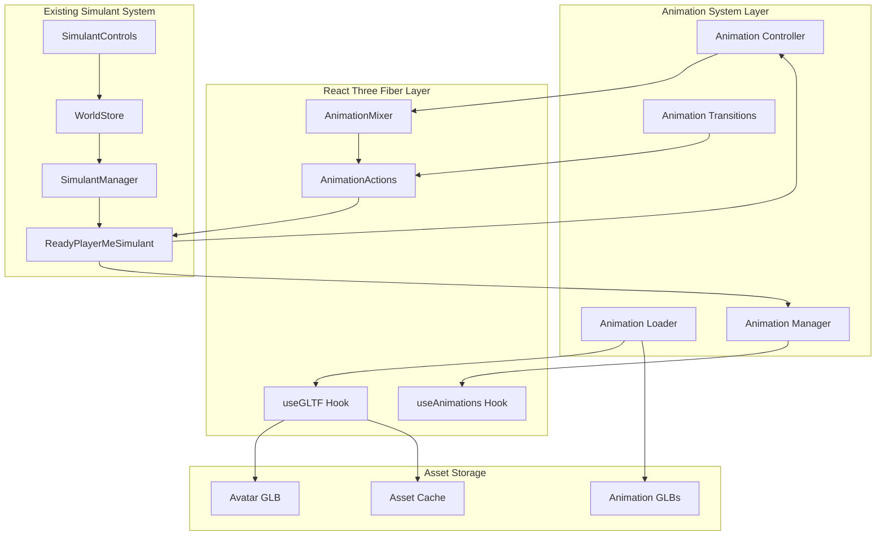

# Design Document

## Overview

The Ready Player Me Animation System enhances the existing Descendants simulant framework by replacing simple geometric avatars with fully animated RPM characters. The system leverages React Three Fiber's useGLTF and useAnimations hooks to load avatar models and external animation clips from local GLB files. It integrates seamlessly with the existing SimulantManager and WorldStore architecture while providing smooth animation transitions, performance optimization, and comprehensive testing controls.

## Architecture

### High-Level Animation System Architecture



### Technology Integration

- **React Three Fiber**: Core 3D rendering and animation hooks
- **Three.js**: AnimationMixer, AnimationClip, and SkeletonUtils
- **Existing Architecture**: Zustand WorldStore, SimulantManager, ReadyPlayerMeSimulant
- **Asset Management**: Local GLB files with caching and preloading
- **Performance**: LOD system, instanced rendering, and memory management

## Components and Interfaces

### Core Animation System

#### AnimationLoader (New Utility)
```typescript
interface AnimationLoader {
  // Asset loading and caching
  loadAvatarGLTF: (path: string) => Promise<GLTF>
  loadAnimationClips: (paths: string[]) => Promise<Map<string, AnimationClip>>
  preloadAssets: () => Promise<void>
  
  // Cache management
  getCachedAvatar: (path: string) => GLTF | null
  getCachedClip: (name: string) => AnimationClip | null
  clearCache: () => void
  
  // Error handling
  validateGLTF: (gltf: GLTF) => ValidationResult
  handleLoadError: (error: Error, assetPath: string) => void
}

interface ValidationResult {
  isValid: boolean
  hasAnimations: boolean
  hasSkeleton: boolean
  boneCount: number
  errors: string[]
  warnings: string[]
}

// Animation clip metadata
interface AnimationClipData {
  name: string
  clip: AnimationClip
  duration: number
  looping: boolean
  category: 'locomotion' | 'idle' | 'action' | 'expression'
  tags: string[]
}
```

#### AnimationManager (Enhanced Hook)
```typescript
interface AnimationManager {
  // Core animation control
  playAnimation: (name: string, options?: PlayOptions) => void
  stopAnimation: (name: string) => void
  crossFadeToAnimation: (name: string, duration?: number) => void
  
  // State management
  currentAnimation: string | null
  isPlaying: boolean
  availableAnimations: string[]
  
  // Performance optimization
  setLODLevel: (level: 'high' | 'medium' | 'low') => void
  pauseAnimations: () => void
  resumeAnimations: () => void
  
  // Event callbacks
  onAnimationStart?: (name: string) => void
  onAnimationEnd?: (name: string) => void
  onAnimationLoop?: (name: string) => void
}

interface PlayOptions {
  loop?: boolean
  crossFadeDuration?: number
  timeScale?: number
  startTime?: number
  weight?: number
}

// Custom hook implementation
function useRPMAnimations(
  gltf: GLTF,
  externalClips: Map<string, AnimationClip>,
  options?: AnimationOptions
): AnimationManager {
  // Implementation details...
}

interface AnimationOptions {
  autoPlay?: string
  crossFadeDuration?: number
  enableLOD?: boolean
  performanceMode?: 'quality' | 'balanced' | 'performance'
}
```

#### AnimationController (State Machine)
```typescript
interface AnimationController {
  // State machine for simulant actions
  currentState: AnimationState
  previousState: AnimationState
  
  // State transitions
  transitionTo: (newState: AnimationState, options?: TransitionOptions) => void
  canTransitionTo: (state: AnimationState) => boolean
  
  // Action mapping
  mapActionToAnimation: (action: string) => string
  getAnimationForState: (state: AnimationState) => string
  
  // Blend tree support
  blendAnimations: (animations: BlendAnimation[]) => void
  setBlendWeight: (animation: string, weight: number) => void
}

type AnimationState = 
  | 'idle' 
  | 'walking' 
  | 'running' 
  | 'jumping' 
  | 'building' 
  | 'thinking' 
  | 'communicating' 
  | 'celebrating'

interface TransitionOptions {
  duration?: number
  easing?: 'linear' | 'ease-in' | 'ease-out' | 'ease-in-out'
  interrupt?: boolean
}

interface BlendAnimation {
  name: string
  weight: number
  timeScale?: number
}

// Enhanced action mapping with priority system
const ENHANCED_ANIMATION_MAPPING = {
  idle: {
    primary: ['F_Standing_Idle_Variations_001', 'F_Standing_Idle_Variations_002'],
    fallback: ['Masculine_TPose'],
    priority: 1
  },
  walking: {
    primary: ['M_Walk_001'],
    fallback: ['M_Crouch_Walk_003'],
    priority: 3
  },
  running: {
    primary: ['M_Run_001'],
    fallback: ['M_Walk_001'],
    priority: 4
  },
  jumping: {
    primary: ['M_Walk_Jump_002'],
    fallback: ['M_Walk_001'],
    priority: 5
  },
  building: {
    primary: ['M_Standing_Expressions_013'],
    fallback: ['F_Standing_Idle_Variations_006'],
    priority: 2
  },
  communicating: {
    primary: ['M_Talking_Variations_005'],
    fallback: ['M_Standing_Expressions_013'],
    priority: 2
  },
  celebrating: {
    primary: ['F_Dances_007'],
    fallback: ['F_Standing_Idle_Variations_001'],
    priority: 2
  }
} as const;
```

### Enhanced ReadyPlayerMeSimulant Component

#### Updated Component Interface
```typescript
interface EnhancedRPMSimulantProps {
  simulant: AISimulant
  modelPath?: string
  animationPaths?: string[]
  scale?: number
  enableAnimations?: boolean
  enableGridSnap?: boolean
  lodLevel?: 'high' | 'medium' | 'low'
  performanceMode?: 'quality' | 'balanced' | 'performance'
  onAnimationChange?: (animation: string) => void
  onLoadComplete?: () => void
  onLoadError?: (error: Error) => void
}

// Enhanced component with external animation support
function EnhancedReadyPlayerMeSimulant(props: EnhancedRPMSimulantProps) {
  // Asset loading
  const avatarGLTF = useGLTF(props.modelPath || '/models/player-ready-player-me.glb')
  const externalClips = useExternalAnimations(props.animationPaths || DEFAULT_ANIMATION_PATHS)
  
  // Animation management
  const animationManager = useRPMAnimations(avatarGLTF, externalClips, {
    autoPlay: 'idle',
    crossFadeDuration: 0.3,
    enableLOD: true,
    performanceMode: props.performanceMode || 'balanced'
  })
  
  // State management
  const animationController = useAnimationController(animationManager, props.simulant)
  
  // Performance optimization
  const lodLevel = useLODLevel(props.simulant.position, props.lodLevel)
  
  // Implementation...
}
```

#### External Animation Loading Hook
```typescript
function useExternalAnimations(animationPaths: string[]): Map<string, AnimationClip> {
  const [clips, setClips] = useState<Map<string, AnimationClip>>(new Map())
  const [loading, setLoading] = useState(true)
  const [error, setError] = useState<Error | null>(null)
  
  useEffect(() => {
    const loadAnimations = async () => {
      try {
        setLoading(true)
        const clipMap = new Map<string, AnimationClip>()
        
        for (const path of animationPaths) {
          const gltf = await new Promise<GLTF>((resolve, reject) => {
            const loader = new GLTFLoader()
            loader.load(path, resolve, undefined, reject)
          })
          
          if (gltf.animations && gltf.animations.length > 0) {
            const clipName = extractClipName(path)
            clipMap.set(clipName, gltf.animations[0])
          }
        }
        
        setClips(clipMap)
        setError(null)
      } catch (err) {
        setError(err as Error)
        console.error('Failed to load external animations:', err)
      } finally {
        setLoading(false)
      }
    }
    
    loadAnimations()
  }, [animationPaths])
  
  return clips
}

// Utility function to extract meaningful names from file paths
function extractClipName(path: string): string {
  const filename = path.split('/').pop()?.replace('.glb', '') || 'unknown'
  
  // Map file names to semantic animation names
  const nameMapping: Record<string, string> = {
    'F_Standing_Idle_Variations_001': 'idle_female_1',
    'F_Standing_Idle_Variations_002': 'idle_female_2',
    'F_Standing_Idle_Variations_006': 'idle_female_3',
    'M_Walk_001': 'walk_male',
    'M_Run_001': 'run_male',
    'M_Walk_Jump_002': 'jump_male',
    'M_Crouch_Walk_003': 'crouch_walk_male',
    'M_Standing_Expressions_013': 'expression_male',
    'M_Talking_Variations_005': 'talk_male',
    'M_Walk_Backwards_001': 'walk_backward_male',
    'F_Dances_007': 'dance_female',
    'Masculine_TPose': 'tpose_male'
  }
  
  return nameMapping[filename] || filename.toLowerCase()
}
```

### Animation Testing Interface

#### AnimationTestControls Component
```typescript
interface AnimationTestControlsProps {
  simulantId?: string
  className?: string
  showAdvanced?: boolean
}

function AnimationTestControls({
  simulantId,
  className = "",
  showAdvanced = false
}: AnimationTestControlsProps) {
  const { simulants, updateSimulant } = useWorldStore()
  const [selectedSimulant, setSelectedSimulant] = useState<string | null>(simulantId || null)
  const [currentAnimation, setCurrentAnimation] = useState<string>('idle')
  const [crossFadeDuration, setCrossFadeDuration] = useState(0.3)
  const [animationSpeed, setAnimationSpeed] = useState(1.0)
  
  // Available animations from the loaded clips
  const availableAnimations = [
    { key: 'idle', label: 'Idle', icon: '🧍' },
    { key: 'walk', label: 'Walk', icon: '🚶' },
    { key: 'run', label: 'Run', icon: '🏃' },
    { key: 'jump', label: 'Jump', icon: '🦘' },
    { key: 'dance', label: 'Dance', icon: '💃' },
    { key: 'talk', label: 'Talk', icon: '💬' },
    { key: 'think', label: 'Think', icon: '🤔' },
    { key: 'celebrate', label: 'Celebrate', icon: '🎉' }
  ]
  
  const handleAnimationChange = useCallback((animationKey: string) => {
    if (!selectedSimulant) return
    
    // Update simulant's last action to trigger animation change
    const actionMap: Record<string, string> = {
      idle: 'Standing peacefully',
      walk: 'Walking around the world',
      run: 'Running with excitement',
      jump: 'Jumping with joy',
      dance: 'Dancing to celebrate',
      talk: 'Talking to friends',
      think: 'Thinking deeply',
      celebrate: 'Celebrating success'
    }
    
    updateSimulant(selectedSimulant, {
      lastAction: actionMap[animationKey] || 'Performing action'
    })
    
    setCurrentAnimation(animationKey)
  }, [selectedSimulant, updateSimulant])
  
  // Component implementation...
}
```

## Data Models

### Animation Asset Management

#### Asset Cache Structure
```typescript
interface AnimationAssetCache {
  avatars: Map<string, GLTF>
  clips: Map<string, AnimationClip>
  metadata: Map<string, AssetMetadata>
  loadingPromises: Map<string, Promise<any>>
}

interface AssetMetadata {
  path: string
  size: number
  loadTime: number
  lastAccessed: number
  referenceCount: number
  isValid: boolean
  errors: string[]
}

// Global cache instance with memory management
class AnimationCache {
  private cache: AnimationAssetCache
  private maxCacheSize: number = 100 * 1024 * 1024 // 100MB
  private maxAge: number = 5 * 60 * 1000 // 5 minutes
  
  constructor() {
    this.cache = {
      avatars: new Map(),
      clips: new Map(),
      metadata: new Map(),
      loadingPromises: new Map()
    }
    
    // Periodic cleanup
    setInterval(() => this.cleanup(), 60000) // Every minute
  }
  
  async loadAvatar(path: string): Promise<GLTF> {
    // Implementation with caching logic...
  }
  
  async loadAnimationClip(path: string): Promise<AnimationClip> {
    // Implementation with caching logic...
  }
  
  private cleanup(): void {
    // Remove old and unused assets
    const now = Date.now()
    
    for (const [key, metadata] of this.cache.metadata) {
      if (now - metadata.lastAccessed > this.maxAge && metadata.referenceCount === 0) {
        this.removeAsset(key)
      }
    }
  }
  
  private removeAsset(key: string): void {
    // Cleanup Three.js resources
    const avatar = this.cache.avatars.get(key)
    if (avatar) {
      avatar.scene.traverse((child) => {
        if (child instanceof Mesh) {
          child.geometry.dispose()
          if (child.material instanceof Material) {
            child.material.dispose()
          }
        }
      })
    }
    
    this.cache.avatars.delete(key)
    this.cache.clips.delete(key)
    this.cache.metadata.delete(key)
  }
}
```

### Animation State Persistence

#### Enhanced Simulant State
```typescript
interface EnhancedAISimulant extends AISimulant {
  // Animation-specific state
  animationState: {
    currentAnimation: string
    previousAnimation: string
    transitionProgress: number
    animationSpeed: number
    isLooping: boolean
    startTime: number
  }
  
  // Performance state
  lodLevel: 'high' | 'medium' | 'low' | 'culled'
  lastRenderTime: number
  animationUpdateFrequency: number
  
  // Asset state
  avatarLoaded: boolean
  animationsLoaded: string[]
  loadingErrors: string[]
}

// Enhanced world store with animation support
interface EnhancedWorldState extends WorldState {
  // Animation system state
  animationCache: AnimationAssetCache
  globalAnimationSettings: {
    enableAnimations: boolean
    defaultCrossFadeDuration: number
    performanceMode: 'quality' | 'balanced' | 'performance'
    maxAnimatedSimulants: number
  }
  
  // Performance monitoring
  animationPerformance: {
    frameRate: number
    memoryUsage: number
    activeAnimations: number
    droppedFrames: number
  }
}
```

## Error Handling

### Animation System Error Recovery

#### Error Types and Handling
```typescript
interface AnimationErrorHandler {
  // Asset loading errors
  handleAvatarLoadError: (path: string, error: Error) => void
  handleAnimationLoadError: (path: string, error: Error) => void
  
  // Runtime animation errors
  handleMixerError: (simulantId: string, error: Error) => void
  handleTransitionError: (from: string, to: string, error: Error) => void
  
  // Performance errors
  handlePerformanceDegradation: (metrics: PerformanceMetrics) => void
  handleMemoryPressure: (usage: number, limit: number) => void
  
  // Recovery strategies
  fallbackToDefaultAnimation: (simulantId: string) => void
  reduceAnimationQuality: (level: number) => void
  restartAnimationSystem: () => Promise<void>
}

// Error recovery strategies
const ERROR_RECOVERY_STRATEGIES = {
  ASSET_LOAD_FAILURE: {
    retry: true,
    maxRetries: 3,
    fallback: 'default_avatar',
    notifyUser: false
  },
  
  ANIMATION_PLAY_FAILURE: {
    retry: false,
    fallback: 'idle',
    notifyUser: false,
    logError: true
  },
  
  PERFORMANCE_DEGRADATION: {
    reduceLOD: true,
    disableAnimations: false,
    notifyUser: true,
    threshold: 30 // FPS
  },
  
  MEMORY_PRESSURE: {
    clearCache: true,
    reduceQuality: true,
    cullDistantSimulants: true,
    threshold: 0.8 // 80% of max memory
  }
} as const;
```

### Graceful Degradation System

#### Performance Adaptation
```typescript
interface PerformanceAdapter {
  // Monitoring
  monitorFrameRate: () => number
  monitorMemoryUsage: () => number
  monitorAnimationLoad: () => number
  
  // Adaptation strategies
  adaptToPerformance: (metrics: PerformanceMetrics) => void
  setLODLevels: (simulants: AISimulant[]) => void
  cullDistantSimulants: (cameraPosition: Vector3) => void
  
  // Quality settings
  setAnimationQuality: (level: 'high' | 'medium' | 'low') => void
  setUpdateFrequency: (fps: number) => void
  enableInstancing: (enable: boolean) => void
}

// Adaptive quality settings
const QUALITY_PRESETS = {
  high: {
    maxAnimatedSimulants: 10,
    animationUpdateRate: 60,
    crossFadeDuration: 0.3,
    enableBlending: true,
    lodDistance: { high: 20, medium: 40, low: 80 }
  },
  
  medium: {
    maxAnimatedSimulants: 6,
    animationUpdateRate: 30,
    crossFadeDuration: 0.2,
    enableBlending: true,
    lodDistance: { high: 15, medium: 30, low: 60 }
  },
  
  low: {
    maxAnimatedSimulants: 3,
    animationUpdateRate: 15,
    crossFadeDuration: 0.1,
    enableBlending: false,
    lodDistance: { high: 10, medium: 20, low: 40 }
  }
} as const;
```

## Testing Strategy

### Unit Testing

#### Animation System Tests
```typescript
// Test suites for animation components
describe('AnimationLoader', () => {
  test('loads avatar GLB successfully', async () => {
    const loader = new AnimationLoader()
    const gltf = await loader.loadAvatarGLTF('/models/player-ready-player-me.glb')
    
    expect(gltf).toBeDefined()
    expect(gltf.scene).toBeDefined()
    expect(gltf.animations).toBeDefined()
  })
  
  test('handles missing animation files gracefully', async () => {
    const loader = new AnimationLoader()
    const clips = await loader.loadAnimationClips(['/nonexistent.glb'])
    
    expect(clips.size).toBe(0)
    expect(console.warn).toHaveBeenCalled()
  })
  
  test('caches loaded assets correctly', async () => {
    const loader = new AnimationLoader()
    const gltf1 = await loader.loadAvatarGLTF('/models/test.glb')
    const gltf2 = await loader.loadAvatarGLTF('/models/test.glb')
    
    expect(gltf1).toBe(gltf2) // Same reference due to caching
  })
})

describe('AnimationManager', () => {
  test('transitions between animations smoothly', () => {
    const manager = createTestAnimationManager()
    
    manager.playAnimation('idle')
    expect(manager.currentAnimation).toBe('idle')
    
    manager.crossFadeToAnimation('walk', 0.3)
    expect(manager.currentAnimation).toBe('walk')
  })
  
  test('handles invalid animation names', () => {
    const manager = createTestAnimationManager()
    
    expect(() => {
      manager.playAnimation('nonexistent')
    }).not.toThrow()
    
    expect(manager.currentAnimation).toBe('idle') // Fallback
  })
})
```

### Integration Testing

#### Component Integration Tests
```typescript
describe('EnhancedReadyPlayerMeSimulant', () => {
  test('renders with external animations', async () => {
    const simulant = createTestSimulant()
    
    render(
      <Canvas>
        <EnhancedReadyPlayerMeSimulant
          simulant={simulant}
          animationPaths={['/animations/M_Walk_001.glb']}
        />
      </Canvas>
    )
    
    await waitFor(() => {
      expect(screen.getByTestId('rpm-simulant')).toBeInTheDocument()
    })
  })
  
  test('responds to simulant action changes', async () => {
    const simulant = createTestSimulant()
    const { rerender } = render(
      <Canvas>
        <EnhancedReadyPlayerMeSimulant simulant={simulant} />
      </Canvas>
    )
    
    // Change simulant action
    simulant.lastAction = 'Walking around'
    rerender(
      <Canvas>
        <EnhancedReadyPlayerMeSimulant simulant={simulant} />
      </Canvas>
    )
    
    // Verify animation change
    await waitFor(() => {
      expect(mockAnimationManager.currentAnimation).toBe('walk')
    })
  })
})
```

### Performance Testing

#### Animation Performance Benchmarks
```typescript
describe('Animation Performance', () => {
  test('maintains 60 FPS with 10 animated simulants', async () => {
    const simulants = Array.from({ length: 10 }, createTestSimulant)
    const frameRates: number[] = []
    
    render(
      <Canvas>
        <PerformanceMonitor onFrame={(fps) => frameRates.push(fps)}>
          {simulants.map(simulant => (
            <EnhancedReadyPlayerMeSimulant
              key={simulant.id}
              simulant={simulant}
            />
          ))}
        </PerformanceMonitor>
      </Canvas>
    )
    
    await waitFor(() => {
      const averageFPS = frameRates.reduce((a, b) => a + b, 0) / frameRates.length
      expect(averageFPS).toBeGreaterThan(55) // Allow 5 FPS tolerance
    }, { timeout: 5000 })
  })
  
  test('memory usage stays within limits', async () => {
    const initialMemory = performance.memory?.usedJSHeapSize || 0
    
    // Load multiple simulants
    const simulants = Array.from({ length: 5 }, createTestSimulant)
    render(
      <Canvas>
        {simulants.map(simulant => (
          <EnhancedReadyPlayerMeSimulant
            key={simulant.id}
            simulant={simulant}
          />
        ))}
      </Canvas>
    )
    
    await waitFor(() => {
      const currentMemory = performance.memory?.usedJSHeapSize || 0
      const memoryIncrease = currentMemory - initialMemory
      expect(memoryIncrease).toBeLessThan(50 * 1024 * 1024) // 50MB limit
    })
  })
})
```

### End-to-End Testing

#### User Interaction Tests
```typescript
describe('Animation Test Controls', () => {
  test('user can switch animations via UI', async () => {
    const user = userEvent.setup()
    
    render(<AnimationTestApp />)
    
    // Click walk button
    const walkButton = screen.getByRole('button', { name: /walk/i })
    await user.click(walkButton)
    
    // Verify animation change
    await waitFor(() => {
      expect(screen.getByTestId('current-animation')).toHaveTextContent('walk')
    })
  })
  
  test('animations transition smoothly', async () => {
    const user = userEvent.setup()
    
    render(<AnimationTestApp />)
    
    // Start with idle
    expect(screen.getByTestId('current-animation')).toHaveTextContent('idle')
    
    // Switch to run
    const runButton = screen.getByRole('button', { name: /run/i })
    await user.click(runButton)
    
    // Verify smooth transition (no jarring jumps)
    await waitFor(() => {
      expect(screen.getByTestId('transition-progress')).toHaveTextContent('100%')
    })
  })
})
```

## Accessibility and Usability

### Animation Accessibility

#### Reduced Motion Support
```typescript
interface AccessibilityOptions {
  respectReducedMotion: boolean
  provideFallbackAnimations: boolean
  enableAnimationDescriptions: boolean
  keyboardNavigationSupport: boolean
}

// Reduced motion implementation
function useReducedMotion(): boolean {
  const [prefersReducedMotion, setPrefersReducedMotion] = useState(false)
  
  useEffect(() => {
    const mediaQuery = window.matchMedia('(prefers-reduced-motion: reduce)')
    setPrefersReducedMotion(mediaQuery.matches)
    
    const handler = (e: MediaQueryListEvent) => {
      setPrefersReducedMotion(e.matches)
    }
    
    mediaQuery.addEventListener('change', handler)
    return () => mediaQuery.removeEventListener('change', handler)
  }, [])
  
  return prefersReducedMotion
}

// Accessibility-aware animation manager
function useAccessibleAnimations(
  animationManager: AnimationManager,
  options: AccessibilityOptions
) {
  const prefersReducedMotion = useReducedMotion()
  
  const playAnimation = useCallback((name: string, playOptions?: PlayOptions) => {
    if (prefersReducedMotion && options.respectReducedMotion) {
      // Use static poses or minimal animations
      const staticPose = getStaticPoseForAnimation(name)
      animationManager.playAnimation(staticPose, { loop: false })
    } else {
      animationManager.playAnimation(name, playOptions)
    }
  }, [animationManager, prefersReducedMotion, options.respectReducedMotion])
  
  return { playAnimation }
}
```

### Developer Experience

#### Comprehensive Documentation and Debugging
```typescript
interface AnimationDebugger {
  // Debug information
  getAnimationState: (simulantId: string) => AnimationDebugInfo
  getPerformanceMetrics: () => PerformanceDebugInfo
  getAssetStatus: () => AssetDebugInfo
  
  // Debug visualization
  showSkeletonHelper: (simulantId: string, show: boolean) => void
  showAnimationCurves: (animationName: string, show: boolean) => void
  highlightActiveSimulants: (highlight: boolean) => void
  
  // Logging and monitoring
  enableVerboseLogging: (enable: boolean) => void
  exportAnimationData: (simulantId: string) => AnimationExportData
  generatePerformanceReport: () => PerformanceReport
}

interface AnimationDebugInfo {
  currentAnimation: string
  animationProgress: number
  blendWeights: Record<string, number>
  boneTransforms: Record<string, Matrix4>
  errors: string[]
  warnings: string[]
}

// Development-only debug panel
function AnimationDebugPanel({ simulantId }: { simulantId: string }) {
  const debugger = useAnimationDebugger()
  const [debugInfo, setDebugInfo] = useState<AnimationDebugInfo | null>(null)
  
  useEffect(() => {
    if (process.env.NODE_ENV === 'development') {
      const interval = setInterval(() => {
        setDebugInfo(debugger.getAnimationState(simulantId))
      }, 100)
      
      return () => clearInterval(interval)
    }
  }, [debugger, simulantId])
  
  if (process.env.NODE_ENV !== 'development') {
    return null
  }
  
  return (
    <div className="fixed top-4 left-4 bg-black/80 text-white p-4 rounded">
      <h3>Animation Debug - {simulantId}</h3>
      {debugInfo && (
        <div className="space-y-2 text-sm">
          <div>Current: {debugInfo.currentAnimation}</div>
          <div>Progress: {(debugInfo.animationProgress * 100).toFixed(1)}%</div>
          <div>Errors: {debugInfo.errors.length}</div>
          <div>Warnings: {debugInfo.warnings.length}</div>
        </div>
      )}
    </div>
  )
}
```

This comprehensive design provides a robust foundation for implementing the Ready Player Me animation system with external GLB animation clips, seamless integration with the existing simulant framework, and comprehensive testing and debugging capabilities.